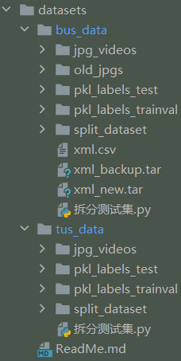

# 数据集

## 1. 可使用的数据集

目前有乳腺和甲状腺数据集，目录如下

```shell
/projects/US/ProjectDatasets/db/breast
/projects/US/ProjectDatasets/db/thyroid
```

## 2. 软连接到数据集

d2的数据集默认在`datasets\`文件夹下，处于数据管理和企业隐私上的方便，需要使用软连接到项目数据集的位置

```shell
ln -s /projects/US/ProjectDatasets/db/breast datasets/bus_data
ln -s /projects/US/ProjectDatasets/db/thyroid datasets/tus_data
```

软连接成功后，`datasets\`文件夹下输入`ls -l`的输出应该如下所示




## 3. 数据集的注册
学习使用一个框架，首先要了解框架的基本原理，之后才应该阅读项目的代码。

d2所使用的数据集需要经过注册才能使用，下面先从一般角度介绍[d2的数据集注册机制](datasets_d2register.md)。

和其他基于d2开发的项目一样，Ultrasound VID的数据集注册相关的文件在``ultrasound_vid/data``下面。在``ultrasound_vid/data/datasets.py``中，进行TUS和BUS的数据集注册，注册函数为``register_dataset``，如下所示。主要逻辑是：首先，获得数据集各个split和完整数据集；其次，注册所有的split和完整数据集。

```python
def register_dataset(
    jpg_root, pkl_root, anno_temp_path, lesion_classes, us_processed_data, organ
):
    """
    jpg_root: 图像所在位置
    pkl_root：pkl文件位置，在这个函数里面只用于找.csv文件（映射关系）
    anno_temp_path：标注文件路径
    lesion_classes：疾病名称
    us_processed_data：超声数据的位置
    organ：器官，甲状腺或乳腺
    """
    dataset_to_build = {}  # dataset_name -> csv_file, num_videos
    for csv_file in pkl_root.files("*.csv"):
        timestamp = csv_file.basename().splitext()[0]   # timestep格式为日期-时分秒，这里只记录日期，如20220926
        if re.match(r"\d{8}-\d{6}.csv", csv_file.basename()) is None:
            continue
        menu = pd.read_csv(csv_file)
        for dataset in set(menu["hospital"].values):
            # 将数据集分为若干split，每个split为医院
            mask = menu["hospital"] == dataset
            device_cnt = Counter()
            for i, row in menu[mask].iterrows():
                device = get_device(row)
                device_cnt.update([device])
            # dataset_name: organ_hospital@timestamp
            dataset_to_build["@".join([organ + "_" + dataset, timestamp])] = (
                csv_file.abspath(),
                sum(device_cnt.values()),
            )
            for device in device_cnt:
                dataset_to_build[
                    "@".join([organ + "_" + dataset, timestamp, device])
                ] = (csv_file.abspath(), device_cnt[device])

        # add ALL dataset to train all hospital data
        # 为了方便，"_ALL"可以直接选择所有的split
        device_cnt = Counter()
        for i, row in menu.iterrows():
            device = get_device(row)
            device_cnt.update([device])
        dataset_to_build["@".join([organ + "_ALL", timestamp])] = (
            csv_file.abspath(),
            sum(device_cnt.values()),
        )

    for dataset_name, (csv_file, num_videos) in dataset_to_build.items():
        # 将数据集名称和对应的加载函数注册到类DatasetCatalog中
        # lambda 函数可接受任意数量的参数，但只能有一个表达式
        # lambda arguments : expression
        DatasetCatalog.register(
            dataset_name,   # dataset_name: organ_hospital@timestamp
            lambda dataset_name=dataset_name, csv_file=csv_file: load_ultrasound_annotations(
                dataset_name,
                csv_file,
                anno_temp_path,
                jpg_root,
                lesion_classes,
                us_processed_data,
            ),  # 加载医准格式的数据集，当然也可以load_coco_json读coco格式数据集等
        )
        # 将数据集的具体信息保存在类MetadataCatalog中
        MetadataCatalog.get(dataset_name).set(
            thing_classes=THING_CLASSES, num_videos=num_videos # 这个split的视频数目
        )
```

医准.csv文件格式
|pkl_file|jpg_folder|neg|video_path|hospital|anno_format|polyline_error|db_key|device|
|:---|---|---|---|---|---|---|---|---:|
|pkl文件（标注）|jpg文件|健康与否，false为不健康，有病灶；true为健康，无病灶|视频|医院|标注格式（json和xml都有）|多边形误差（一般为false）|数据库位置|设备（一般为null）|


之后便是注册TUS和BUS的数据集

```python
TRAIN = True
if TRAIN:
    TUS_JPG_ROOT = (PROJ_ROOT / "datasets" / "tus_data" / "jpg_videos").realpath()
    TUS_PKL_ROOT = (PROJ_ROOT / "datasets" / "tus_data" / "pkl_labels_trainval").realpath()
    TUS_ANNO_TEMP_PATH = PROJ_ROOT / "outputs" / "tus_annos_trainval"
else:
    TUS_JPG_ROOT = (PROJ_ROOT / "datasets" / "tus_data" / "split_dataset" / "jpg_videos").realpath()
    TUS_PKL_ROOT = (PROJ_ROOT / "datasets" / "tus_data" / "split_dataset" / "pkl_labels_test").realpath()
    TUS_ANNO_TEMP_PATH = PROJ_ROOT / "outputs" / "tus_annos_test"
assert TUS_JPG_ROOT.exists()
assert TUS_PKL_ROOT.exists()
TUS_ANNO_TEMP_PATH.makedirs_p()
TUS_PROCESSED_DATA = "/projects/US/ProjectDatasets/db/thyroid"
TUS_LESION_CLASSES = ("结节", "其他异常")

register_dataset(
    TUS_JPG_ROOT,
    TUS_PKL_ROOT,
    TUS_ANNO_TEMP_PATH,
    TUS_LESION_CLASSES,
    TUS_PROCESSED_DATA,
    "thyroid",
)


BUS_JPG_ROOT = (PROJ_ROOT / "datasets" / "bus_data" / "jpg_videos").realpath()
assert BUS_JPG_ROOT.exists()
BUS_PKL_ROOT = (PROJ_ROOT / "datasets" / "bus_data" / "pkl_labels_trainval").realpath()
assert BUS_PKL_ROOT.exists()
BUS_ANNO_TEMP_PATH = PROJ_ROOT / "outputs" / "bus_annos_trainval"
BUS_ANNO_TEMP_PATH.makedirs_p()
BUS_PROCESSED_DATA = "/projects/US/ProjectDatasets/db/breast"
BUS_LESION_CLASSES = ("Mass", "Low-echo-zone", "Structural-disorder", "Lymph-node")

register_dataset(
    BUS_JPG_ROOT,
    BUS_PKL_ROOT,
    BUS_ANNO_TEMP_PATH,
    BUS_LESION_CLASSES,
    BUS_PROCESSED_DATA,
    "breast",
)
```

在``register_dataset``中有两个函数``get_device``和``load_ultrasound_annotations``，其实现如下

```python
# 不同标注格式的jpg文件命名不同，在此进行区分
def get_device(row):
    jpg_folder = row["jpg_folder"]
    if row["anno_format"] == "xml":
        return Path(jpg_folder).splitall()[-3]
    return Path(jpg_folder).basename().split("_")[1]
```

```python
def load_ultrasound_annotations(
    dataset_name, csv_file, anno_temp_path, jpg_root, lesion_classes, us_processed_data
):
    # 返回dataset_dicts
    logger.info(f">> >> >> Getting annotations start.")
    logger.info(f"dataset name: {dataset_name}")

    dataset_dicts = []
    world_size = get_world_size()
    rank = get_rank()
    dump_manager = DumpManager(rank, world_size)

    # dataset_name: organ_hospital@timestamp(@device)
    dataset_name_parts = dataset_name.split("@")
    device = None
    hospital = dataset_name_parts[0].split("_")[-1]
    if len(dataset_name_parts) == 3:
        device = dataset_name_parts[-1]
    anno_stats_path = os.path.join(anno_temp_path, dataset_name + ".json")
    df = pd.read_csv(csv_file)

    if hospital == "ALL":
        num_annos = len(df["hospital"])
    else:
        num_annos = int(sum(df["hospital"].values == hospital))

    dump_manager.check_data_update(anno_stats_path, num_annos)
    for _, row in df.iterrows():
        if hospital != "ALL" and row["hospital"] != hospital:
            continue
        if device is not None and get_device(row) != device:
            continue
        jpg_folder = Path(us_processed_data) / row["jpg_folder"]
        pkl_file = Path(us_processed_data) / row["pkl_file"]
        json_path = Path(jpg_folder) / "info.json"
        with open(json_path, "r") as f:
            video_info = json.load(f)
        if video_info["empty_flag"]:
            continue  # not enough effective frames to sample
        video_folder = jpg_folder
        relpath = os.path.relpath(video_folder, jpg_root)
        file_name = relpath.replace("/", "_")
        # assert (
        #    len(glob(f"{video_folder}/*.jpg")) == video_info["num_frames"]
        # ), f"{video_folder} frames mismatch"

        anno = dict()
        if not row["neg"]:
            with open(pkl_file, "rb") as f:
                anno = pickle.load(f)
            anno["anno_path"] = pkl_file
        anno["dataset"] = dataset_name
        anno["is_negative"] = row["neg"]
        anno["anno_format"] = row["anno_format"]  # xml or json?
        anno["relpath"] = relpath
        anno["db_key"] = row["db_key"]
        anno["video_folder"] = video_folder
        anno["height"] = video_info["cropped_shape"][0]
        anno["width"] = video_info["cropped_shape"][1]
        anno["video_info"] = video_info
        anno["frame_annos_path"] = dump_manager.dump_anno(
            os.path.join(anno_temp_path, file_name),
            anno,
            lesion_classes,
            negative=row["neg"],
        )
        if "frame_anno" in anno:
            anno.pop("frame_anno")
        dataset_dicts.append(anno)

    anno_stats = {"num_annos": num_annos}
    if is_main_process():
        with open(anno_stats_path, "w") as fp:
            json.dump(anno_stats, fp)

    logger.info(
        f"<< << << Getting annotations done. {dataset_name} {len(dataset_dicts)}"
    )
    synchronize()
    return dataset_dicts
```

``load_ultrasound_annotations``最终返回``dataset_dicts``，类型为``list(dict())``。每个元素为``anno``，类型为``dict()``，含义是一个视频训练所需要的信息。

``anno``的每个``key``和``value``如下

|anno_path|dataset|is_negative|anno_format|relpath|db_key|video_folder|height|width|video_info|frame_annos_path|
|:---|---|---|---|---|---|---|---|---|---|---:|
|标注路径|数据集名字|健康与否|标注格式|图片路径|数据库中的键|视频路径|视频长|视频宽|视频信息|帧标注路径（二进制化）|

其中``video_info``的每个``key``和``value``如下

|num_frames|bbox|cropped_shape|height_resize_ratio|static_frames|empty_flag|
|:---|---|---|---|---|---:|
|视频帧数|标注框|裁剪尺寸|高度缩放比例|静止帧位置|有无标注框|

