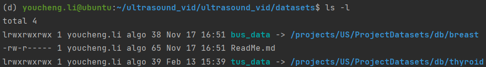

# 数据集

## 1. 可使用的数据集

目前有乳腺和甲状腺数据集，目录如下

```shell
/projects/US/ProjectDatasets/db/breast
/projects/US/ProjectDatasets/db/thyroid
```

## 2. 软连接到数据集

d2的数据集默认在`datasets\`文件夹下，处于数据管理和企业隐私上的方便，需要使用软连接到项目数据集的位置

```shell
ln -s /projects/US/ProjectDatasets/db/breast datasets/bus_data
ln -s /projects/US/ProjectDatasets/db/thyroid datasets/tus_data
```

软连接成功后，`datasets\`文件夹下输入`ls -l`的输出应该如下所示




## 3. 数据集的注册

d2所使用的数据集需要经过注册才能使用，下面先从一般角度介绍[d2的数据集注册机制](datasets_d2register.md)。


