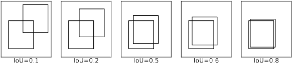

# 视频目标检测指标

模型的目标是尽可能“准确”地预测标注框，然而如何衡量模型的预 测结果与实际标注结果之间的差距？本节首先介绍如何计算两个框的重合度，然后通 过重合度阈值判定是否成功检测出病灶。进而得到单帧内的评价指标，最后对视频内 所有帧取均值视频级别的评价指标。

## 1. 单帧评价指标

**IoU** 借鉴单帧检测中的 IoU（Intersection over Union）概念来刻画两个框的“重合程度”。IoU 定义为两个框的交集面积和两个框的并集面积的比值。

$$\text{IoU} = \frac{b_i \cap b_j}{b_i \cup b_j}$$

其中$ |𝑏 |$表示矩形框 $b$ 的面积，可以看到 IoU 的值域为 $ [0, 1 ]$。

**GIoU** 当两个框没有交集时，无论它们相距多远，IoU 都恒等于 0。对没有交集的框希望能够给出一个值说明它们之间差距的远近。GIoU（Generalized IoU）解决了 这个问题。定义$b_{ij}$是包含$b_i$和$b_j$的最小矩形框。GIoU 定义为 IoU 减去 $b_{ij}$中除$b_i$和$b_j$以外的面积与$b_{ij}$面积的比值，可以看到 GIoU 的值域为$ (-\infty,1 ]$。

$$\text{GIoU} = \text{IoU} - \frac{ | b_{ij} /  (b_i \cup b_j ) |}{ |b_{ij} |}$$

**TP、FP、FN** 定义预测框与标注框的 IoU 大于某个阈值（如 0.5）即为成功预测（匹配）了这个标注框。定义真阳性（True Positive，TP）为成功匹配了某标注框的预测 框个数；假阳性（False Positive，FP）为没有成功匹配任何标注框的预测框个数；假阴 性（False Negative，FN）为没有被任何预测框成功匹配任何标注框个数。所有标注框 记为$B =   \{ b^1, \cdots , b^n  \}$，指标集$I =  \{1, \cdots, n \}$；所有预测框记为$\hat{B} =  \{ \hat{b}^1, \cdots, \hat{b}^{m_i}  \}$，指标集$J =  \{1, \cdots, m \}$。

$$\text{TP} =  |  \{ j\in J | \exists I,s.t.\text{IoU} (b_i, \hat{b}_j )>0.5 \} |$$

$$\text{FP} =  | \{j\in J|\forall i \in I, \text{IoU} (b_i,\hat{b}_j ) \leq 0.5  \}  |$$

$$FN =  | \{i\in I | \forall j \in J, \text{IoU} (b_i, \hat{b}_j ) \leq 0.5 \}  |$$

其中$ |\cdot |$表示集合的元素个数。假阳性是超声检查中模型对医生造成的不必要的干扰， 假阴性是漏检的病灶个数。

**Precision、Recall** 定义准确率（Precision）为全部预测框中预测正确的概率；召回率（Recall）为全部标注框中被成功预测的概率。对于医疗领域的检测工作，漏检是比较严重的问题，可能导致病人没有及时接受治疗而病情恶化，所以首先应该关注的 是模型的召回率。

$$\text{Precision} = \frac{\text{TP}}{ (\text{TP} + \text{FP} )},\text{Recall} = \frac{\text{TP}}{ (\text{TP} + \text{FN} )}$$

