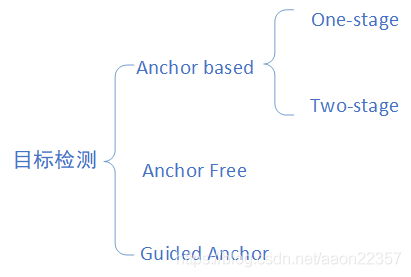
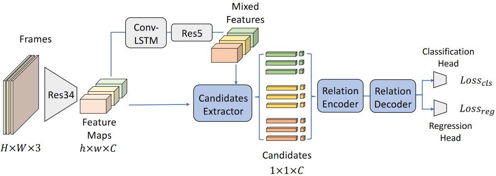

# Ultrasound VID模型

超声视频目标检测项目本质也是目标检测。在d2基础上开发遵循其训练流程。首先介绍d2如何使用默认模型和自定义模型；之后介绍Ultrasound VID的模型。

## 1. d2使用默认模型和自定义模型

详情请见[d2使用默认模型和自定义模型](d2_model.md)

## 2. Ultrasound VID的模型

### 2.1. 目标检测快览

检测器通常由两部分组成：backbone和head。前者在ImageNet上进行预训练，后者用来预测类别信息和目标物体的边界框。

对于backbone部分，在GPU平台上运行的检测器，它们的backbone可能是VGG, ResNet, ResNetXt,或者是DenseNet。在CPU平台上运行的检测器，它们的backbone可能是SqueezeNet，MobileNet或者是ShuffleNet。

对于head部分，通常分为两类：one-stage和two-stage的目标检测器。Two-stage的目标检测器的代表是R-CNN系列，包括：fast R-CNN, faster R-CNN,R-FCN和Libra R-CNN. 还有基于anchor-free的Two-stage的目标检测器，比如RepPoints。One-stage目标检测器的代表模型是YOLO, SSD和RetinaNet。在最近几年，出现了基于anchor-free的one-stage的算法，比如CenterNet, CornerNet, FCOS等等。

在最近几年，目标检测器在backbone和head之间会插入一些网络层，这些网络层通常用来收集不同的特征图。我们将其称之为目标检测器的neck。通常，一个neck由多个bottom-up路径和top-down路径组成。使用这种机制的网络包括Feature Pyramid Network（FPN）,Path Aggregation Network（PAN），BiFPN和NAS-FPN。

<details><summary><em>目标检测中anchor based/anchor free/one stage/two stage分类依据</em></summary>

<br>



**Two-stage**
*R-CNN，SPPNet，Fast R-CNN，Faster R-CNN，R-FCN，FPN，Mask R-CNN等*

two-stage检测器包括两个步骤：

- 第一步，使用RPN生成anchor并对anchor做筛选，过滤掉很多的负样本proposals，生成**稀疏**的proposals；
- 第二步，进行分类和回归，对选择的proposals，使用roi pooling等操作，进一步的精细化，因此得到的框更加精准。（比如，一个anchor有可能只覆盖了一个目标的50%，但却作为完全的正样本，因此其预测肯定是有误差的。）


**One-stage**
*OverFeat，YOLO，YOLOv2，YOLOv3，SSD，DSSD，DSOD，RetinaNet等*

One-stage检测器步骤：
在指定特征图上，对每个位置，使用不同scale、不同长宽比**密集采样**生成anchor（没有对这些anchor进行筛选），直接进行分类和回归。主要优点是计算效率高，但是，检测精度通常落后于Two-stage方法。

【注意】：yolo没有anchor，使用单个神经网络直接预测object的类别和位置。

**【One-stage精度低】**：
原因：
主要原因是类别不均衡问题（**因为没有对负类的anchor进行删除**）。
解决方案：
为了改善类别不均衡问题，RetinaNet提出了**Focalloss**重建标准交叉熵损失，降低easy sample的权重，增加hard sample的权重。

**【One-stage对小物体检测不好（没有Two-stage好）】**：
原因：
如果所有的anchor都没有覆盖到这个目标，那么这个目标就会漏检。如果一个比较大的anchor覆盖了这个目标，那么较大的感受野会弱化目标的真实特征，得分也不会高。two-stage算法中的roi pooling会对目标做**resize**, 小目标的特征被放大，其特征轮廓也更为清晰，因此检测也更为准确。
解决方案：

最直接的提升就是增大input size（但是不能一味的增大，因为会让后面的特征量增大，时间增多，失去One-stage的速度优势）
借鉴FPN，把深层特征通过反卷积，然后通过skip pooling来结合底层的特征层。（结合的方式上有： concat, pixel-wise sum/ add等）（这样做的好处是，只用SSD的话虽然用了底层特征图，但是底层语义特征比较弱，处理小物体时效果表现的不好）
空洞卷积增加感受野（TridentNet）
attention机制（One-stage中目前用的好像比较少）
Two-Stage和One-Stage方法的结合
RON，RefineDet等

RefineDet（CVPR2018） https://blog.csdn.net/u014380165/article/details/79502308
RefineDet是one-stage和two-stage的结合，FPN和SSD的结合。 由三个模块构成：

anchor refinement module (ARM) ——类似于RPN，用来生成anchors并过滤
transfer connection block (TCB)——类似于FPN，做特征转换，将ARM的输出转换成ODM的输入，
object detection module (ODM)——类似于SSD，融合不同层特征，做multi class classification和regression。
One-stage和Two-stage的比较
【个人理解】two-stage的好处在于第一步是将anchor生成出来，经过了筛选，第二步是使用roi pooling之后再进一步的精细化，因此更加精准。

two-stage检测算法将检测问题划分为两个阶段，第一阶段产生候选区域（region proposals）（并筛选），然后对候选区域分类（一般还需要对位置精修）
one-stage检测算法，anchor产生后，直接用于后续的分类和回归。没有经过筛选。

**Anchor-Free**
DenseNet(百度2015)，CornerNet(ECCV2018)，ExtremeNet（CVPR2019）、FSAF（CVPR2019）、FCOS（CVPR2019）等

https://zhuanlan.zhihu.com/p/62103812
https://zhuanlan.zhihu.com/p/62372897

**Guided Anchoring**
Guided Anchoring可以说是anchor-free和anchor-based结合
对于anchor-based检测器而言，anchor的选取很重要，anchor需要能够尽可能多的覆盖所有的目标尺寸和宽高比，在检测的过程中，每个检测器只负责预测尺寸和宽高比与之相近的物体。
anchor是事先选择的。它们是恒定的，在训练期间不会改变。
（PS：每个边界框回归称为一个检测器）

现在有一种新的方式，就是让检测器自己学anchor——guided anchor
Guided Anchoring: 物体检测器也能自己学 Anchor https://zhuanlan.zhihu.com/p/55854246

</details>


所以，现阶段的目标检测器主要由4部分组成：
**Input、Backbone（提取特征训练）、Neck（整合收集特征）、Head（目标检测）**。


### 2.2. Ultrasound VID模型（UltraDet）

#### 2.2.1. 建模依据

使用RDN作为baseline在数据集上训练和验证，发现的问题有

- 小病灶漏检
- 病灶多发帧表现不佳

当然，2023版本的UltraDet也存在一些问题

- 静止帧不佳
- memory机制的有效性的验证


<details><summary><em>RDN的性能不佳的原因分析</em></summary>

<br>

#### 2.2.2. 固定 Candidates 灵活度太低

“漏检问题”是乳腺超声视频需要关注的重要问题。要提高模型对病灶的检出率， 首先就要有丰富而准确的 Candidates，如果在第一阶段模型的检出率就很低，第二阶段 不可能通过 Candidates 之间的信息结合找到被第一阶段漏掉的病灶。

主流的单帧检测器如 DETR、Sparse R-CNN固定初始化缺乏灵活性，需要多层 Heads 来不断调整 Candidates 以达到较精确的结果。Sparse R-CNN的 不同初始框几乎没有差别，几乎与图像的边缘重合。这是因为 Sparse R-CNN 学习到从 全图出发可以获得更多的信息来收缩初始框得到合理的标注框。这样就导致初始框几乎没有提供任何信息，加重了后续 attention 模块的负担。

如果能够通过一个一阶段的检测器先针对输入帧检测出对应的（但可能是较为粗 糙的）检测框，就能给后续的“微调”模块以较为灵活的先验知识。具体来说是针对每一帧检测得到的先验知识而对整个数据集标注框分布的先验知识，信息量增大很多。

#### 2.2.3. RPN 检测效果不足

RDN、MEGA等效果最好的自然视频检测模型采用了 Faster R-CNN 中的 RPN 模块。本文认为，采用类似 RPN 的 Candidates Extractor 无法较好找到应该关注的区域，导致病灶的激活程度不如边缘。虽然后续的 Classification Head 可以进行判断，但更好的特征图可以减轻其负担，以更好地区分低回声区域是否为病灶。

#### 2.2.4. 一对多匹配不利于下游任务

一对多匹配对一个标注框会产生多个预测框，并且这些预测框的置信度都很接近， 不利于下面的 Attention、Relation 之类的模块进行帧内、帧间信息的结合。第一阶段 的模型应该对一个标注框只给出一个预测框。若对一对多匹配模型进行非极大值抑制 （NMS）操作，则会影响模型端到端学习的连贯性，可能导致最合适的 Candidate 被抑制。

#### 2.2.5. 锚定框形状不够丰富

基于 anchor 的模型无法很好地拟合与 anchor 形状差距较大的病灶框。模型需要 提前设定 anchor 的宽-高比，且由于运算量的限制，往往无法设置很丰富的宽高比，由 表2.1得到数据中有约 5% 的病灶的宽-高比 ≤ 1 或 > 3。导致一些形状与 anchor 形状差 距较大的病灶无法被检出。Anchor 的大小也受到限制，若设置很多较小的 anchor 会引入较大的计算量。所以 anchor 的一般不能照顾到小病灶，导致小病灶漏检问题较为严重。

而类似 FCOS和 DeFCN这样 Anchor Free 的方法则没有这样的限制，每个特征图上的像素作为“预测者”可以自由地给出不同长宽比和不同大小的预测框。

#### 2.2.6. Relation Encoder 模块表达能力不足

超声视频具有“病灶的边缘较模糊”需要后续结合时间信息（即前后帧的病灶位 置）来尝试消除模糊；同时“肿块可能与其他正常的低回声结构和良性病变相似”，需 要结合空间信息（即其他类似病灶的区域与当前区域的关系）来更好地判断。

多发病灶的漏检很可能是 RDN 模型中单个 Relation 模块需要承担的任务太多导致 的。RDN 中一个 relation 模块既需要学习帧内的信息来判断是否为病灶，又需要学习帧间的信息来微调预测框。而 RDN 中为同一个模块负责，可能导致每个任务都无法学到最好。

</details>


#### 2.2.7. UltraDet模型



#### 2.2.7.1. 骨架网络

**Backbone** 采用计算机视觉中最经典的 ResNet。ResNet 主要解决的问题是神 经网络效果随深度增加出现“饱和”的现象，层数增加到一定深度网络的效果反而会下 降。这并非过拟合问题，因为训练误差呈现相同的“饱和”趋势。如果增加的层都学到恒 等映射，效果也不会比浅层的网络更差。

Backbone 采用的 ResNet 系列网络根据参数量可分为多种不同架构，本文最终采用Res34 网络结构。采用更大 Res50 会造成在 backbone 处耗时过长，并且存在过拟合的 可能性。而采用更小 Res18 会导致模型的性能下降。

**特征金字塔** 在自然视频检测数据集中，采用特征金字塔（Feature pyramid Network，FPN）能够结合不同尺度的信息，以更好地检测出小物体。然而在超声视频数据 集中，病灶的大小差异没有自然数据集那么悬殊，采用 FPN 反而会导致不同层之间的 物体特征有分辨率上的差别，从而难以很好地交换信息。实验表明，不采用 FPN 可以 得到更好的效果。同时为了提高速度，我们改变原来采用 FPN 的 {p2,p3,p4,p5,p6,p7} 作 为 RoI Head 的输入的做法，只采用 Res34 的 C4 层作为 RoI Head 的输入，大大提高了 RoI Head 速度的同时效果并没有下降。这也是超声视频检测与自然视频检测的一大不 同之处。

**Conv-LSTM** 1997 年提出的长短时记忆网络（LSTM）模型是自然语言处理中 最常用的经典循环神经网络模型之一，直到 2018 年才逐渐被 Transformer 取代。RNN 通过循环更新参数，提取并结合一个序列的信息。LSTM 通过巧妙的结构设计解决了 普通 RNN 的梯度消失和梯度爆炸问题。可以在 backbone 中利用 LSTM 的卷积版本 （Conv-LSTM）来结合多帧的特征图，以达到在 RoI Head 之前就使特征图初步结合其他 帧的信息的效果。这里的结合是全图层面的结合，还没有各个 Candidates 层面的信息 交互。

#### 2.2.7.2. 检测头

检测头或者 RoI Head（Region of Interest Head）承担了从特征图中提取可能是病灶 的区域（即 Candidates），并进行信息结合以微调，最终给出检测框以及置信度的任务。 

**Candidates Extractor 模块** 借鉴 Faster R-CNN中提出的 RPN 模块，本文提出 的 UltraDet 模型也采用两阶段的方法：第一阶段由一个 Candidadtes Extractor 从全图的 特征图中提取 Candidates；第二阶段对 Candidates 的特征做进一步加工并输出预测框和 对应的置信度。 为了不使帧间的信息交互影响到帧内 Candidates 的提取，DRF 模型采用未经过 Conv-LSTM 的特征图进行帧内的 Candidates 提取，而提取完 Candidates 后采用经过 Conv-LSTM 的特征图进行 RoI Align。

**Relation Encoder-Decoder 模块** Candidates需要结合帧内语义信息来更好地判断它是一个病灶还是只是普通腺体；需要结合帧间 位置信息来更好地确定病灶的边缘位置。比如某一帧边缘模糊的病灶在前一帧的边缘 较清晰，则结合了前一帧病灶的位置信息可以辅助本帧病灶位置的判断。故 UltraDet 模型采用了 Relation 模块进行帧内、帧间的信息结合。为了更好地通过 Relation 模块结 合帧内和帧间的信息，本文设计了 Relation Encoder-Decoder 模块，通过先编码后解码 的流程使语义信息和位置信息的结合更加充分。

**Classification Head** 与传统的 Faster R-CNN 并没有太大不同，通过 𝑀 层 MLP， 将充分结合信息之后的 candidates 特征向量的通道数压缩到类别数。得到前景置信度 后可以通过 Softmax Cross Entropy Loss或者 Focal Loss来计算与标注的差距。本文 中第一阶段的 Frame Specific Candidates Extractor 采用 Focal Loss 模块，因为正负样本 差距较悬殊；第二阶段 Relation Encoder-Decoder 模块采用的是 Softmax Cross Entropy Loss。

**Regression Head** 定义一个框 𝑏 = (𝑥0, 𝑦0, 𝑥1, 𝑦1) 其中 (𝑥0, 𝑦0) 是框左上角点的坐标， (𝑥1, 𝑦1) 是框右下角点的坐标。通过 𝑀 层 MLP（与分类 Head 不共享参数）将每个 candidate 的特征向量映射到四维。得到预测框后可以通过 𝐿1 Loss 或者 Smooth 𝐿1 Loss 来计算与标注的差距。也可以通过 IoU Loss 或者 GIoU Loss来计算损失。本 文中第一阶段的 Frame Specific Candidates Extractor 回归的目标是每个“预测者”到预 测框的边的上下左右距离，采用的是 GIoU Loss；第二阶段 Relation Encoder-Decoder 模 块采用预测的是标注框与第一阶段预测框的差距采用的是 Smooth 𝐿1 Loss。


#### 2.2.7.3. 代码结构

和pytorch中的Faster R-CNN类似，d2检测模型的结构也是meta-arch+x模块化的。配置文件中关于模型的部分摘录如下


``configs/RDN-LSTM/BUS-RDN_LSTM.yaml``
```yaml
MODEL:
  WEIGHTS: "pretrained_models/r34.pkl"
  PIXEL_MEAN: [123.675, 116.280, 103.530]
  PIXEL_STD: [58.395, 57.120, 57.375]
  META_ARCHITECTURE: "TemporalRCNN"
  ROI_HEADS:
    NAME: "Res5TemporalROIBoxHeads"
    PROPOSAL_APPEND_GT: True
  ROI_BOX_HEAD:
    INTERVAL_PRE_TEST: 12
    INTERVAL_AFTER_TEST: 3
  RESNETS:
    DEPTH: 34
    STRIDE_IN_1X1: False
    RES2_OUT_CHANNELS: 64
  RPN:
    POST_NMS_TOPK_TEST: 16
  ANCHOR_GENERATOR:
    ASPECT_RATIOS: [[0.33, 0.5, 0.66, 1.0, 2.0, 3.0]]
    SIZES: [[32, 64, 128, 256, 512]]
```

``configs/RDN-LSTM/BUS_BasicConfig_StaticFrame.yaml``
```yaml
_BASE_: "MIXED-RDN_LSTM.yaml"
MODEL:
  ORGAN_SPECIFIC:
    ENABLE: ("cls", "rpn_cls")
  BACKBONE:
    FREEZE_AT: 1
    NAME: "build_resnet_backbone_mix_style"
  RESNETS:
    HALF_CHANNEL: True
  USE_LSTM: True
  PROPOSAL_GENERATOR:
    NAME: "DeFCN"
  DeFCN:
    NMS_THRESH_TEST: 0.7
    NMS_TYPE: "normal"
    FOCAL_LOSS_GAMMA: 2.0
    FOCAL_LOSS_ALPHA: 0.9
    IN_FEATURES: [ "res4" ]
    FPN_STRIDES: [ 16 ]
    NUM_PROPOSALS: 12
  ROI_BOX_HEAD:
    INTERVAL_PRE_TEST: 11
    INTERVAL_AFTER_TEST: 0
```

